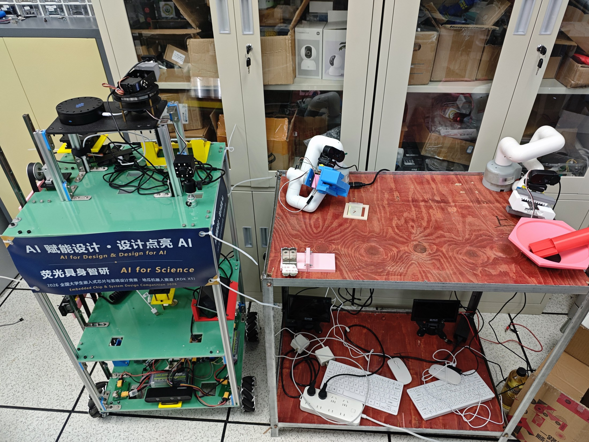
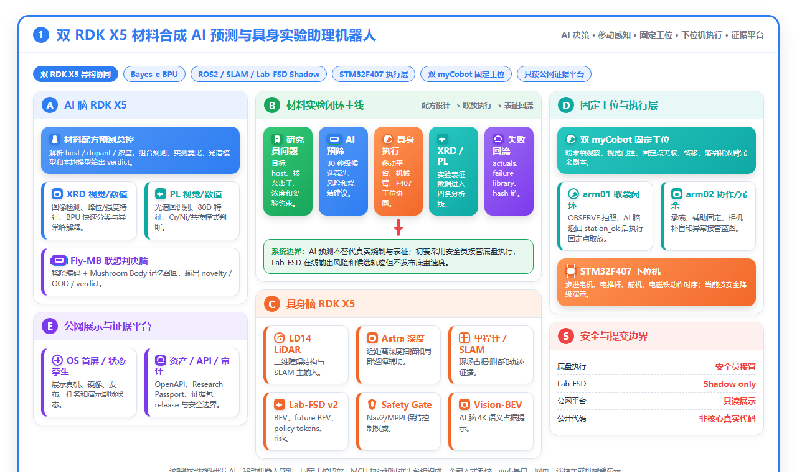
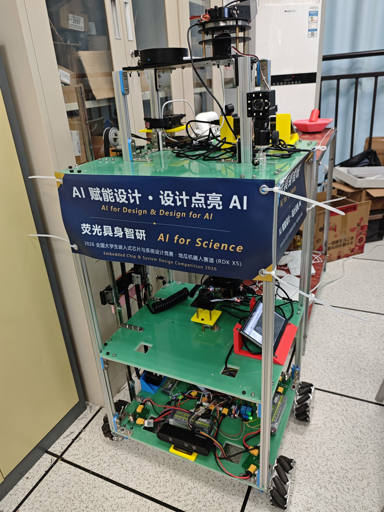
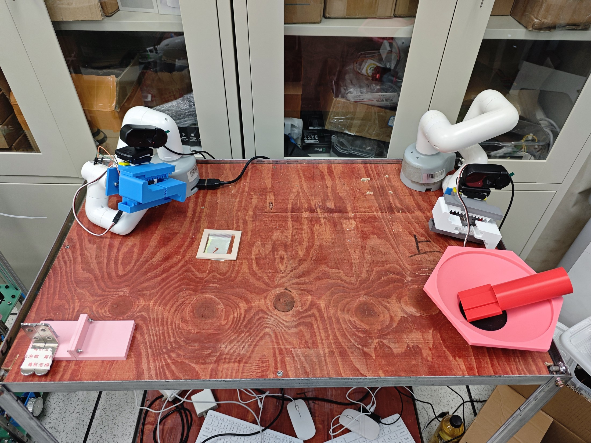
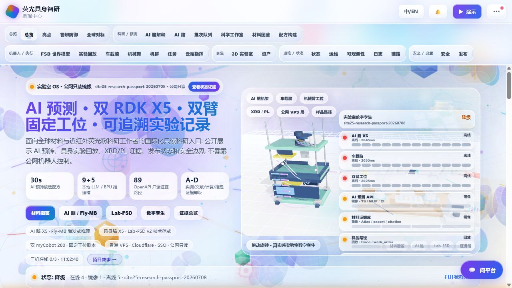
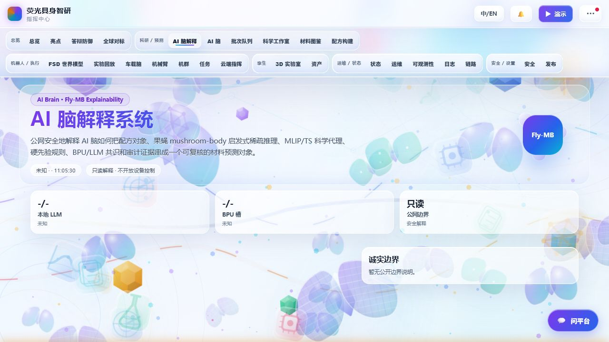

# XRD Smart Lab｜双 RDK X5 材料智能与多机具身实验助理｜第九届（2026）全国大学生嵌入式芯片与系统设计竞赛 · 地瓜机器人赛题 · 西南赛区第 1 名

**基于双 RDK X5 异构协同的材料合成 AI 预测与多机具身实验助理机器人**

> 西南赛区第 1 名为队伍确认结果，官方排名来源待补；全国总决赛奖项待组委会正式公布。

[English](README_en.md) · [文档中心](docs/README.md) · [安全离线开始](docs/getting-started/QUICKSTART_OFFLINE.md) · [证据索引](docs/evidence/EVIDENCE_INDEX.md) · [已知限制](docs/evaluation/KNOWN_LIMITATIONS.md)

[](LICENSE)
[](docs/architecture/SYSTEM_ARCHITECTURE.md)
[](docs/safety/PHYSICAL_SAFETY.md)
[](docs/evidence/CLAIM_MATRIX.csv)

> 面向半导体光电子器件与先进封装功能材料的边缘材料智能平台：以近红外荧光粉为真实验证载体，连接材料候选、XRD/PL 分析、边缘推理、移动具身辅助、双机械臂实验工作站和只读证据展示。

## 竞赛与奖项

项目参加第九届（2026）全国大学生嵌入式芯片与系统设计竞赛 · 芯片应用赛道 · 地瓜机器人赛题，队伍“荧光具身智研”。奖项唯一权威数据源是 [`docs/competition/award_status.yaml`](docs/competition/award_status.yaml)。

<!-- AWARD_STATUS:START -->
| 阶段 | 当前状态 | 事实边界 |
| --- | --- | --- |
| 西南赛区 | 第1名 | `team_confirmed`：队伍确认，官方排名来源待补 |
| 全国总决赛 | 奖项待组委会正式公布 | 待官方公布：不预测、不预填奖项 |
<!-- AWARD_STATUS:END -->

[竞赛说明与更新规则](docs/competition/AWARDS.md) · [官方与公开来源](docs/competition/OFFICIAL_SOURCES.md)

## 项目全景



项目把“算法演示”拆成五个权责清晰的工程模块：

- **AI 脑**：材料预测、证据约束推理、XRD/PL 视觉与数值分析、按需模型编排。
- **具身脑**：LiDAR/深度/里程计等感知接入、移动实验助理流程，以及无运动权限的 BEV/占据流研究候选。
- **双机械臂工作站**：固定任务下的投袋、状态确认和研磨协作；研究模型与冻结动作链隔离。
- **STM32F407 执行层**：底盘、升降、推杆、舵机和电磁铁的底层通信与安全状态。
- **指挥中心**：脱敏状态、研究证据和项目内容的只读展示，不反向控制设备。

系统不是“一个大模型控制所有硬件”。模型、感知、动作、审计和公网展示拥有不同权限；`shadow` 或审计通过都不会自动授予动作权。



[阅读完整系统架构、数据边界与权限矩阵 →](docs/architecture/SYSTEM_ARCHITECTURE.md)

## 已验证状态

以下数字来自仓库内 2026-08-04 的 PC acceptance、独立 board overlay 和双板收口回执；每项均保留输入与状态边界。

| 范围 | 结论 | 不能扩大解释为 |
| --- | --- | --- |
| 模型注册 | 50/50 唯一逻辑模型达到 PC release-ready | 50 个模型全部在 X5 上通过 |
| X5-local 模型库 | 49 个逻辑模型状态完整：冻结基线 11 + 新增 38 | 49 个模型同时常驻或同时运行 |
| 新增 38 个候选 | 31 `X5_VALIDATED` / 4 `BOARD_EXPERIMENTAL` / 3 `BOARD_REJECTED` | 所有候选都可生产使用 |
| BPU-primary | 24/24 在 actual X5 Bayes-e BPU 执行 | 每个模型都通过语义或质量门 |
| CPU-primary | 14 个中 11 个完成 actual X5 CPU 推理 | 被拒绝的 3 个也已运行 |
| 三套分段 BPU LLM | 六个分段文件 actual BPU 执行；三套均保持实验态 | 通用自由生成或固定 token 一致 |
| 具身脑 v5r1 | 固定输入 actual BPU、200 次延迟、固定张量差分、30 次恢复通过 | 真实相机准确率、导航成功率或运动控制 |
| 集成 Cortex | `MONITOR_OFFLINE` | 完整实时多传感器闭环 |
| 双臂后继候选 | X5 被动 fixture replay；阶段分类头固定样本验收 | 真实学习策略或动作权限 |

模型会计采用“唯一逻辑模型”而非导出格式、量化版本、提示词或随机种子计数。板端 `X5_VALIDATED` 只表示按需单模型固定任务合同通过。

[逐项证据 →](docs/evidence/EVIDENCE_INDEX.md) · [机器可读断言矩阵 →](docs/evidence/CLAIM_MATRIX.csv)

## 三套 BPU LLM 为什么仍是实验态

`F-LLM-03/04/05` 是三套独立领域权重，每套拆为两个 BPU 分段。六个分段均在 actual X5 BPU 执行，且段间内容绑定成立；但三套模型的固定 next-token 都与合同期望不一致。因此项目保留真实执行证据，也保留 `BOARD_EXPERIMENTAL` 结论，不把“能跑”写成“语义正确”，更不宣传通用问答或自由生成。

这类失败保留机制同样适用于资产不完整的 rejected 候选和质量门未通过的模型。

## 复现分层

| Tier | 你能复现什么 | 默认风险与权限 |
| ---: | --- | --- |
| 0 | 文档、图片、报告、静态站点和证据 | 无安装、无设备 |
| 1 | mock、fixture、合同与离线 replay | PC 本地；禁止硬件访问 |
| 2 | 获得许可的数据/模型评估 | 独立下载、固定版本与哈希 |
| 3 | RDK X5 固定输入推理 | 板卡环境；没有运动权限 |
| 4 | 真实传感器、执行器与机器人 | 现场人工授权、急停和物理隔离 |

第一次接触项目请从 [Tier 0/1 安全离线快速开始](docs/getting-started/QUICKSTART_OFFLINE.md) 进入。仓库根目录已验证以下 Tier 1 命令；它们不访问网络、相机、串口、GPIO、机器人 SDK 或执行器：

```bash
python -B tools/publication/audit_release.py --root . --strict
python -B tools/publication/check_markdown_links.py . --format text
python -B tools/publication/render_award_status.py --check
python -B tools/publication/generate_sbom.py --check
python -B -m unittest discover -s tests_public -p "test_*.py" -v
python -B examples/offline_demo/run_demo.py
```

本次发布已通过公开边界审计、仓内文档链接检查、奖项单一事实源检查、确定性 SPDX SBOM 检查、无硬件单元测试、离线 demo 和工作站前端构建。精确复核范围与命令见 [v1.0.0 验证记录](docs/releases/v1.0.0/VERIFICATION.md)。

> [!CAUTION]
> 仓库包含可能控制真实底盘、升降、机械臂、推杆、舵机和电磁铁的源码。不要把源码存在理解为运行许可。Tier 4 不提供通用一键命令；任何真机操作前必须阅读 [物理安全规范](docs/safety/PHYSICAL_SAFETY.md)。

## 仓库地图

| 路径 | 内容 | 文档入口 |
| --- | --- | --- |
| [`ai_brain/`](ai_brain/) | 材料预测、XRD/PL、ICMat 50 模型候选 | [AI 脑](docs/modules/AI_BRAIN.md) |
| [`embodied_brain/`](embodied_brain/) | ROS 2、移动感知、v5r1/vNext/Cortex 候选 | [具身脑](docs/modules/EMBODIED_BRAIN.md) |
| [`workstation/`](workstation/) | 双臂冻结链与 replay-only 后继候选 | [双机械臂](docs/modules/DUAL_ARM_WORKSTATION.md) |
| [`firmware/stm32f407/`](firmware/stm32f407/) | STM32F407 固件与执行层 | [固件](docs/modules/STM32F407.md) |
| [`web/command_center/`](web/command_center/) | 指挥中心与只读公开站 | [指挥中心](docs/modules/COMMAND_CENTER.md) |
| [`safety/`](safety/) | RB-VoE 等只读安全审计实现 | [系统架构](docs/architecture/SYSTEM_ARCHITECTURE.md) |
| [`evidence/`](evidence/) | 脱敏发布候选回执与 acceptance | [证据索引](docs/evidence/EVIDENCE_INDEX.md) |
| [`schemas/`](schemas/) | 状态接口合同和示例 | [快速开始](docs/getting-started/QUICKSTART_OFFLINE.md) |
| [`assets/`](assets/) | 系统图片与经审核媒体 | 本页下方画廊 |
| [`report_source/`](report_source/) | 竞赛报告源文件和图表源 | [公开边界](docs/safety/PUBLICATION_BOUNDARY.md) |
| [`public_site_static/`](public_site_static/) | 可离线打开的历史只读站点快照 | [指挥中心](docs/modules/COMMAND_CENTER.md) |

旧的 `edge_public/`、`workstation_public/` 和 `public_evidence_data/` 继续作为早期公开快照与安全 mock 边界保存；它们不替代当前完整模块。

## 图像导览

[打开完整项目实物与演示画廊 →](docs/gallery.md)。画廊逐项记录裁切、时间码、来源哈希和真实性边界；其中若展示公开站页面，均为版本化的**归档截图/静态快照**，不是当前在线状态，也不是对受访问保护 live 站点的截图声明。

| 移动实验助理 | 双机械臂工作站 |
| --- | --- |
|  |  |

| 软件总览 | AI 脑界面 |
| --- | --- |
|  |  |

演示媒体必须标明 `live`、`shadow`、`replay` 或 `sim-only`。当前画廊只收录完成来源哈希、隐私和元数据复核的素材；可识别队员的合影在取得明确肖像授权前不发布。原始大视频优先作为版本 Release 资产，不反复写入 Git 历史。

## 数据、模型与许可

- 团队有权发布且未携带更具体声明的源码按 [Apache-2.0](LICENSE) 提供。
- 数据集、基座模型、论文、字体、网页库和媒体保留各自许可，不由顶层许可证重新授权。
- 材料资源的 URL、版本、许可、风险与断言边界记录在 [`source_catalog.v1.json`](ai_brain/icmat_foundry/contracts/source_catalog.v1.json)。
- 凭据、个人/设备身份、未授权实验数据、逐文档受限语料以及不可再分发工件不进入公开制品。

详见 [第三方声明](THIRD_PARTY_NOTICES.md)、[NOTICE](NOTICE) 和 [公开发布边界](docs/safety/PUBLICATION_BOUNDARY.md)。

## 已知限制与路线图

项目不会隐藏失败状态。发布工程门已通过，但这不改变技术限制：三套 BPU LLM 语义门未通过、具身 Cortex 未完成真实同步会话、双臂学习候选仍是 replay、Tier 4 复现依赖具体硬件与现场安全条件，且部分数据/模型不能直接再分发。

[完整已知限制](docs/evaluation/KNOWN_LIMITATIONS.md) · [发布工程状态与研究路线](ROADMAP.md) · [变更记录](CHANGELOG.md)

## 贡献、支持与引用

- 贡献前阅读 [CONTRIBUTING.md](CONTRIBUTING.md)；硬件和公开断言修改需要额外审查。
- 普通问题见 [SUPPORT.md](SUPPORT.md)，安全问题按 [SECURITY.md](SECURITY.md) 私下报告。
- 维护与决策原则见 [MAINTAINERS.md](MAINTAINERS.md)，社区规范见 [CODE_OF_CONDUCT.md](CODE_OF_CONDUCT.md)。
- 学术或工程复用请引用 [`CITATION.cff`](CITATION.cff) 对应的版本；若后续版本获得归档 DOI，再优先使用 DOI。

## 名称与事实原则

“XRD Smart Lab”是项目名称，也对应系统中的 X 射线衍射分析能力。项目不使用“全球第一”“完全自主”等不可验证表述，不把荧光粉等同于全部集成电路材料，不把仿真/回放写成真实闭环，也不在官方公布前预测全国奖项。
