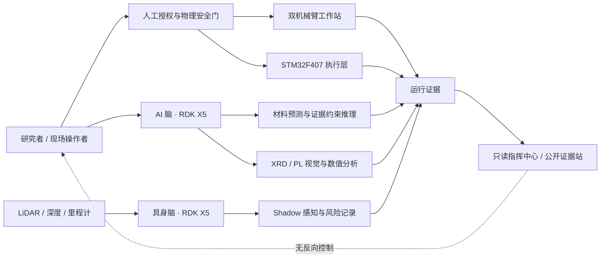

# 系统架构

XRD Smart Lab 把材料信息处理、边缘 AI、移动具身助理、双机械臂工作站、底层执行器和只读证据展示连接为一个可追溯系统。近红外荧光粉是已完成真实验证的材料载体；面向电子材料、制程、SEM 与封装的扩展使用公开基准、固定任务、回放或仿真证据，不能被概括为完整晶圆厂验证。

## 逻辑拓扑

图中的连线表示逻辑信息流，不表示所有服务同时在线，也不授予网络或动作权限。

## 五个公开模块

| 模块 | 主要职责 | 已验证边界 | 不应推导的结论 |
| --- | --- | --- | --- |
| AI 脑 | 配方候选、XRD/PL 分析、检索与模型编排 | 50 个唯一逻辑模型形成 PC 验收；49 个 X5-local 有状态覆盖 | 49 个模型同时常驻、所有模型均板端通过或自由生成可靠 |
| 具身脑 | 传感器接入、移动辅助、BEV/占据流研究 | v5r1 固定张量在 actual X5 BPU 验收，状态为 shadow-only | 完整实时多传感器融合、导航成功率或自主控制 |
| 双机械臂工作站 | 投袋、研磨和运行证据 | 冻结 v3 动作链有真机回执；后继学习候选是被动回放 | 学习策略已获得真机动作权限或物理泛化 |
| STM32F407 | 底盘、升降、推杆、舵机、电磁铁等底层时序 | 串口合同、急停与冻结演示链存在 | 开环升降具备工业级定位、限位冗余或无人值守能力 |
| 指挥中心 | 状态、研究证据与项目展示 | 公开站点是只读边界 | 互联网侧可控制机器人或访问内部设备 |

## 模型会计

- 50 个唯一逻辑模型 = 11 个冻结 X5 基线 + 38 个决赛新增候选 + 1 个 PC-only MACE-MPA-0。
- 49 个 X5-local 模型是**按需模型库**，不是 49 个模型同时驻留内存或同时推理。
- 38 个新增候选板端状态为：31 `X5_VALIDATED`、4 `BOARD_EXPERIMENTAL`、3 `BOARD_REJECTED`。
- 24/24 BPU-primary 在 actual X5 Bayes-e BPU 执行；14 个 CPU-primary 中 11 个完成 actual X5 CPU 推理。
- `F-LLM-03/04/05` 的六个分段 BPU 文件均实际执行，但固定 next-token 不一致，因此三套模型保持 `BOARD_EXPERIMENTAL`，不宣传通用自由生成。

完整证据见 [EVIDENCE_INDEX.md](../evidence/EVIDENCE_INDEX.md)。

## 权限与故障传播

| 路径 | 默认权限 | 失败处理 |
| --- | --- | --- |
| AI 模型候选 | 隔离、按需、无生产覆盖 | 保留 rejected/experimental 状态，不修改合同凑数 |
| 具身研究候选 | shadow-only，无运动命令 | 标记 monitor offline，不阻断冻结演示 |
| 双臂后继学习候选 | replay-only，无相机/串口/SDK 权限 | 记录拒绝或回放失败，不转化为动作 |
| 只读审计 | 显式一次性运行，默认关闭 | 报告问题后退出，不作为系统启动依赖 |
| 公开指挥中心 | 只读 | 外部不可用不应改变设备状态 |

真实动作由现场操作者、冻结执行入口、急停、固件状态机和机械安全条件共同决定。软件状态或模型置信度本身不等于动作授权。

## 状态词汇

- `live`：数据确实来自当前传感器或真实运行，并有来源标记。
- `shadow`：读取或计算真实/回放输入，但没有控制权。
- `assist`：仅为操作者或权威算法提供辅助证据。
- `replay`：使用已记录或指令派生序列，不是当前现场执行。
- `sim-only`：仅仿真或合成数据验证。
- `offline`：未接入实时运行图。
- `experimental`：实际执行过，但一个或多个语义/质量门未通过。
- `rejected`：未满足运行资产或验收合同，不作为可用能力。

任何性能数字都必须同时说明输入、后端、样本数和这些状态之一。
