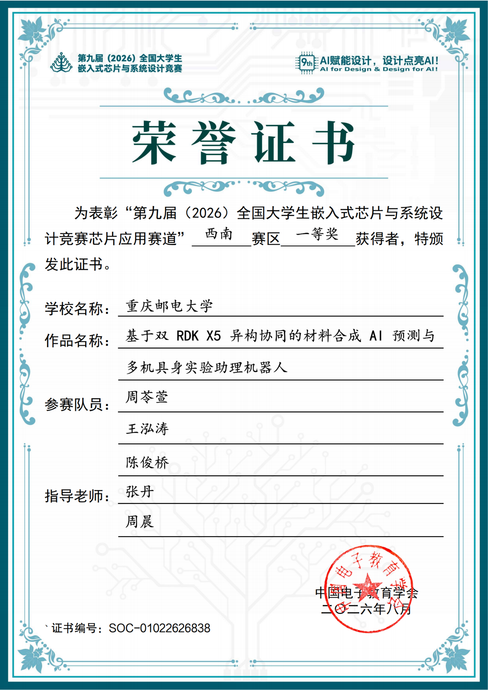
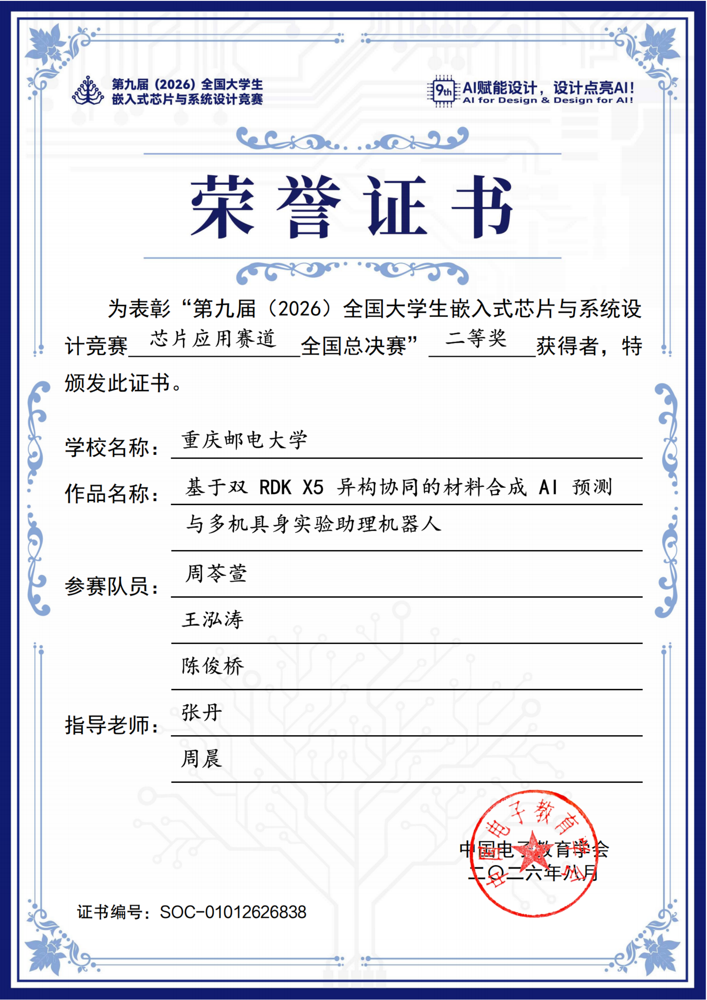

# 竞赛与奖项

奖项信息只从 [`award_status.yaml`](award_status.yaml) 读取。该文件是唯一权威数据源；README 与本页中的文字是发布时生成的展示，不应单独手改。

<!-- AWARD_STATUS:START -->
| 阶段 | 当前状态 | 证据边界 |
| --- | --- | --- |
| 西南赛区 | 一等奖 | [`certificate_verified`：官方获奖证书](../../assets/media/certificates/southwest-regional-first-prize-certificate.png) |
| 全国总决赛 | 二等奖 | [`certificate_verified`：官方获奖证书](../../assets/media/certificates/national-final-second-prize-certificate.png) |
<!-- AWARD_STATUS:END -->

## 官方获奖证书

| 西南赛区一等奖 | 全国总决赛二等奖 |
| --- | --- |
|  |  |

两张证书由中国电子教育学会颁发，比赛名称、芯片应用赛道、阶段、奖项、重庆邮电大学、完整作品名、参赛成员和指导教师均可直接核对。公开 PNG 与收到的原文件逐字节一致，不做裁切、打码、调色或内容编辑；两张图均只含 PNG 的 `IHDR`、`IDAT`、`IEND` 数据块，不携带 EXIF、GPS、XMP、ICC 或文本元数据。

`certificate_verified` 表示仓库已保存颁奖机构出具的官方证书公开件，并核验文件路径、SHA-256、颁发机构、证书编号、签发月份和核验日期；它不虚构一个不存在的组委会网页 URL。未来若获得可长期访问的官方成绩页面，可把状态升级为 `official_verified` 并增加 HTTPS 来源，但不得替换或重写当前证书证据。

奖项展示只由 `python tools/publication/render_award_status.py` 从本页上方的唯一事实源生成。`python tools/publication/render_award_status.py --check`、发布审计和媒体完整性检查都会校验证书文件与声明哈希；任何错配或篡改都会使发布门失败。
