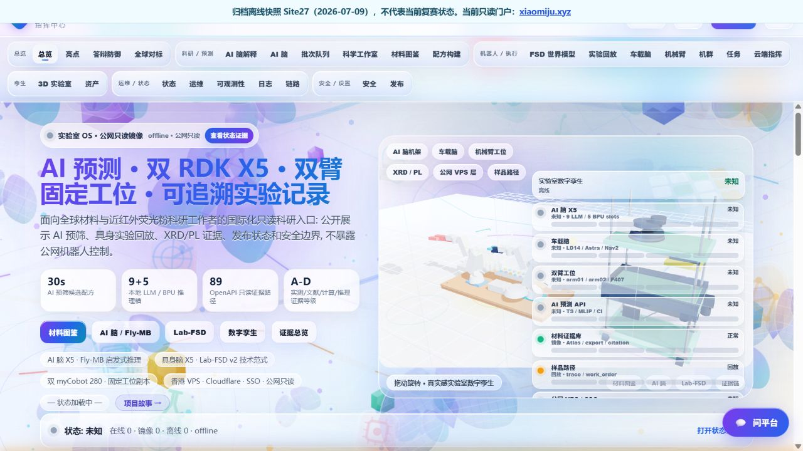
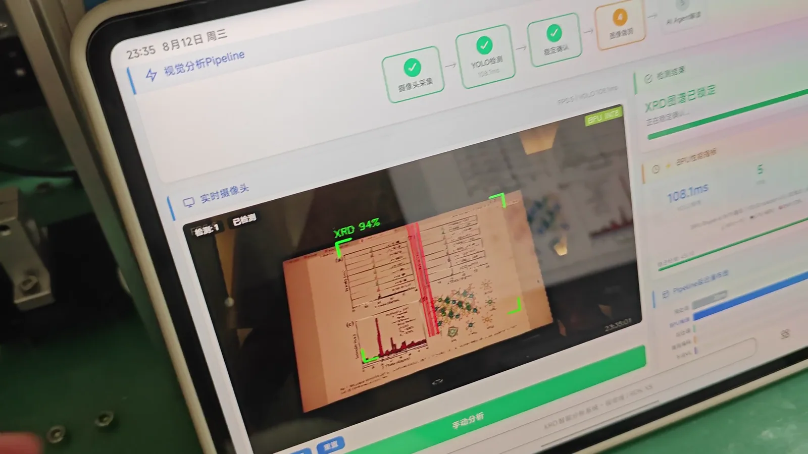
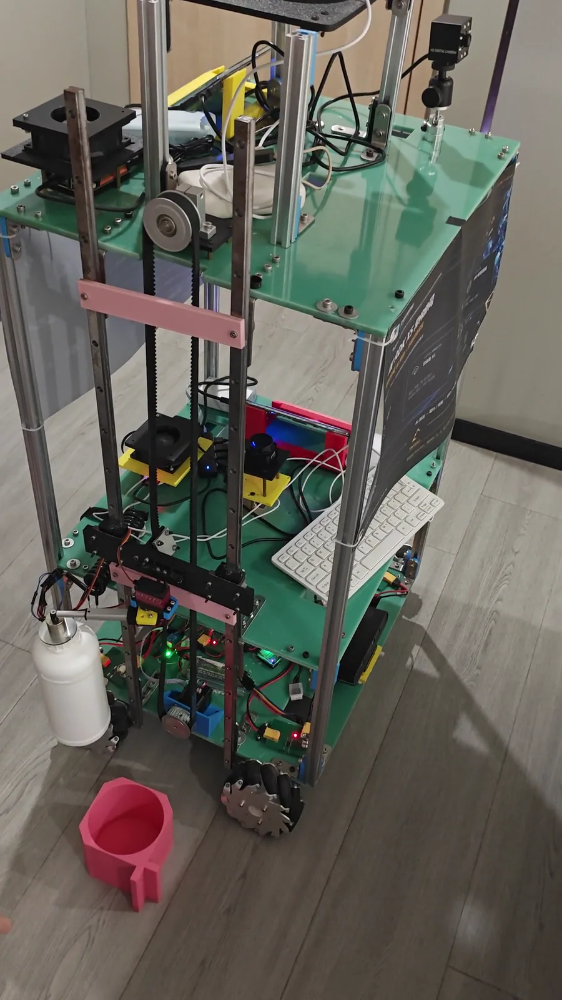
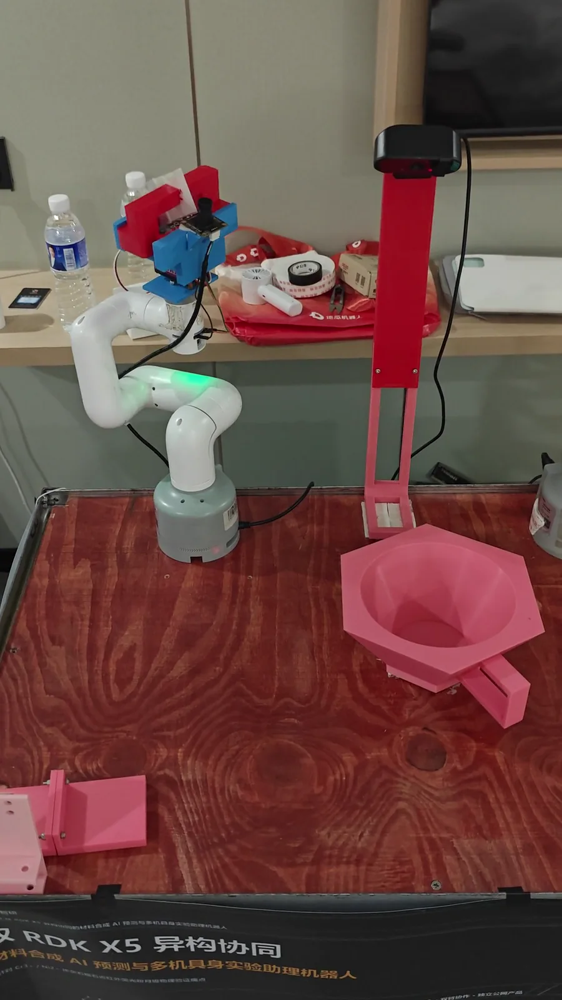
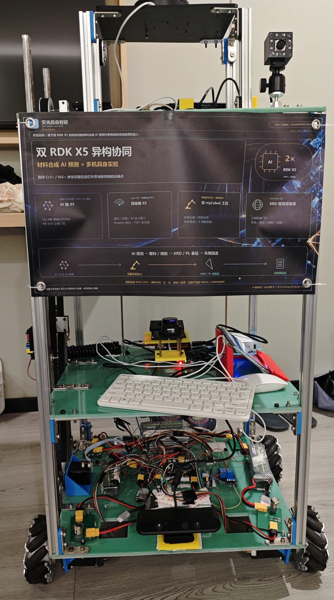
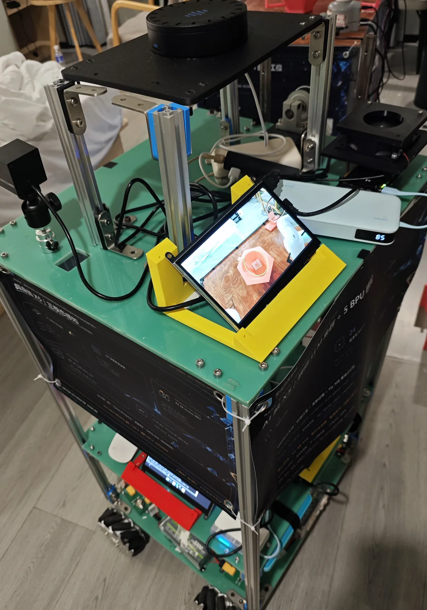
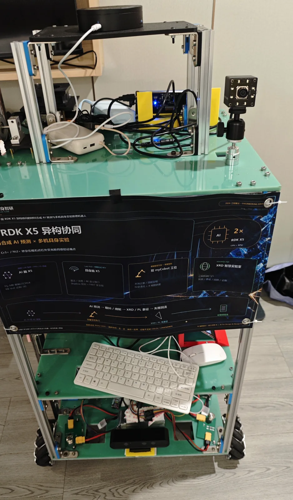
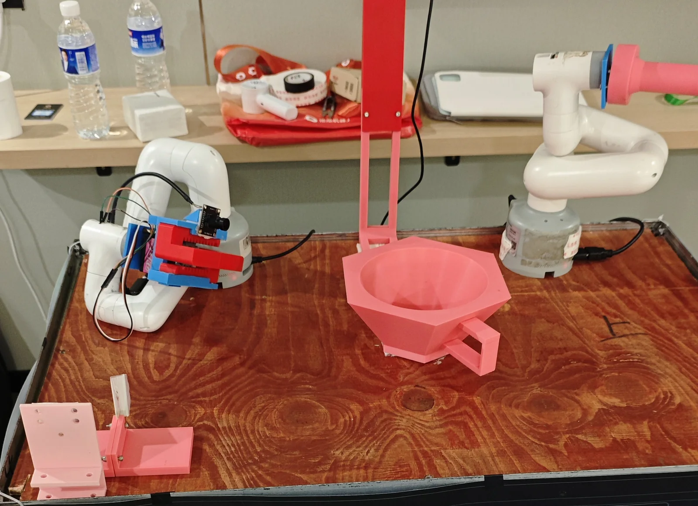

# 项目实物与演示画廊

本页只收录完成来源哈希、隐私和元数据复核的公开媒体。所有视频都已移除音轨和手机定位元数据；人物仅有无法识别身份的手/前臂入镜。逐文件来源、裁切、时间码和 SHA-256 见 [`MEDIA_PROVENANCE.yml`](../assets/media/MEDIA_PROVENANCE.yml)。

> [!IMPORTANT]
> 这些照片和短片记录的是特定设备、特定演示时刻。它们不能替代测试回执，也不能把人工准备、固定任务或真机演示扩大解释为端到端自主系统。

## 公开站离线归档快照

这是仓库内 `public_site_static/index.html` 的 **Site27 离线归档快照（2026-07-09）**。它不连接真实设备，也不代表 `xiaomiju.xyz` 的当前在线状态；截图没有绕过公网入口的访问控制。画面里的状态值是归档页面中的历史/静态展示数据，不是实时遥测。

## 材料 AI：XRD 视觉分析界面

[观看 19 秒静音 MP4](../assets/media/videos/dashboard-xrd-pipeline.mp4)

片段记录平板上的 XRD 视觉分析流程和项目硬件。画面中的置信度、延迟与计数是这一次演示的界面读数，不构成跨数据集性能或通用实时性声明。

## 具身实验助理：升降与瓶体工装

[观看 18 秒静音 MP4](../assets/media/videos/embodied-bottle-lift-assisted.mp4)

片段从人工准备之后开始：接收工装已经放置，瓶体也已固定在升降机构上。这里展示的是升降和平台硬件动作，**不是**自主取瓶、自主导航或端到端无人实验流程。

## 双机械臂：真机工作站演示

[观看 24 秒静音 MP4](../assets/media/videos/dual-arm-hardware-demo.mp4)

这是双机械臂工作站的**真机演示**，证明录制工装上的实体硬件发生了动作。它不证明学习策略、无人值守能力或任务级泛化；学习候选与冻结动作链的边界以双臂模块文档和证据索引为准。

## 设备照片

| 移动实验助理正面 | 传感器与本地显示 |
| --- | --- |
|  |  |

| 移动实验助理三分之四视角 | 双机械臂实验工位 |
| --- | --- |
|  |  |

照片只做裁切、缩放和 WebP 压缩，没有生成、补绘或美化不存在的设备内容。原始手机 EXIF/GPS 不随发布文件分发。

## 未发布素材

- 项目海报原图包含二维码，为避免公开非必要跳转入口，本次不发布，也没有用涂抹方式改造纪实内容。
- 含可识别队员的合影未进入发布仓；待取得明确肖像授权并重新完成隐私审核后，才能作为独立更新加入。
